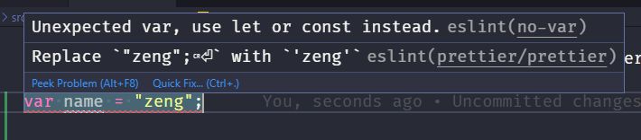

# SEproject

```json
//若重新启动
//在package.json中

  "husky": {
    "hooks": {
      "pre-commit": "npm run lint-staged"
    }
  },
```

> 问题：Ant Design Pro：只有 pages 或 page 目录下的页面才能插入资产。

解决办法：

```js
set BABEL_CACHE=none&&umi dev
```

## ESlint

在 vscode 中安装 ESlint 和 prettier 插件。不符合要求的代码会以波浪线标出。因为设置了自动格式化，像缩进和空格这种问题可以直接 Crtl+S 保存当前文件，保存的同时会进行自动格式化，此外，在切换编辑器的时候也会进行自动格式化。除此之外，部分特殊的错误可能需要根据提示手动修改，例如：



第一个错误提示使用不允许使用 var，需手动将其修改为 let。第二个错误是违反了 prettier 规则的问题，一般 prettier 的规则可以通过保存自动修复。所以在此需要将 var 修改为 let 后进行一次自动格式化。

**注意：为使自动格式化生效，需保证当前文件没有语法错误。且因为 vscode 的配置文件夹在 course 文件夹内，所以开发需要将 course 文件夹作为根目录通过 vscode 打开**

代码需保证没有红色波浪线，即错误存在。如果**因特殊需求实在无法满足** eslint 某条规则，可通过注释的方式 disable，参考

[eslint docs](https://eslint.org/docs/user-guide/configuring.html#configuring-rules)
